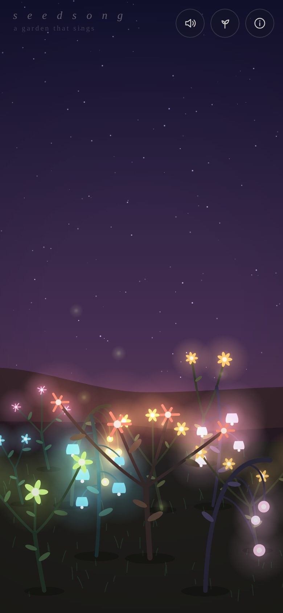
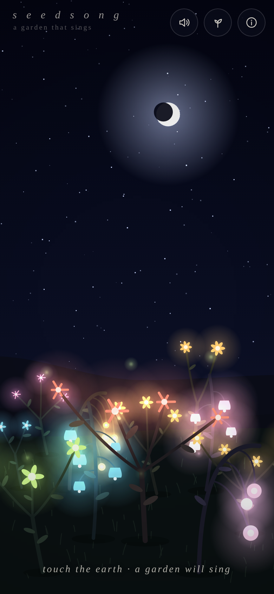

# 🌱 seedsong

*a garden that sings*

**Play it now: https://claude.ai/code/artifact/45ff353d-dc5b-4f7a-b42a-c1a96e833ede**

<p align="center">
  
  
</p>

Touch the ground and a seed takes root. Every plant that grows is a
one-of-a-kind species — its shape, colors, bloom, and voice are all grown from
a single random number. Every bloom is an instrument: each plant is assigned
notes from the garden's own musical scale and chimes them into an endless,
ever-changing ambient song that never plays the same way twice.

Stay a while. The sun sets, the stars come out, fireflies drift between the
flowers, and sometimes a star falls.

## How to play

- **Tap the earth** — plant a seed and watch it grow into a new species.
- **Tap a flower** — open its field-guide card: a botanical name and a small
  secret, both generated just for it.
- **Tap the sky** — a seed rides the wind down and plants itself where it
  lands. At night, you may summon a shooting star.
- **♪ button** — mute or unmute the garden.
- **🌿 button** — start a completely new garden (new species, new hills, new
  musical key).
- **The URL is your garden.** The address bar quietly encodes everything
  you've planted — copy the link and send it to someone, and they'll walk
  through your exact garden.

Sound on. Headphones are even better — every flower sings from where it
stands (stereo position follows its place in the field).

## What's under the hood

One HTML file. No dependencies, no build step, no assets, no network calls.

- **Procedural botany** — four plant archetypes (lantern-stalks, chorus-bushes,
  weeping chimewillows, bellflowers) whose skeletons, leaves, and blooms are
  generated per-seed with a deterministic PRNG (mulberry32), so a shared
  garden regrows identically anywhere.
- **Generative music** — pure Web Audio synthesis: per-plant oscillator voices
  with envelopes, a lowpass filter, stereo panning, ping-pong-ish delay, and a
  convolution reverb whose impulse response is itself synthesized noise. Each
  garden picks a root note and a pentatonic scale, so every plant is always in
  key with its neighbors. A slow root-and-fifth pad and filtered-noise wind
  breathe underneath.
- **A living sky** — keyframed day/night cycle (~3 minutes per day), value-noise
  wind that bends every stem and blade of grass, twinkling stars, a rising and
  setting sun and moon, fireflies that seek out the blooms after dark.
- **Tiny poetry engine** — every species gets a Latin-ish binomial name and a
  one-line secret, generated from its seed.
- **State in the URL** — the whole garden serializes into the `#g=` fragment
  (and localStorage), so gardens are shareable and survive reloads.

## Run it yourself

```
python3 -m http.server 8000
# open http://localhost:8000
```

or just open `index.html` in a browser.

### Deploying to your own URL

The whole app is the single `index.html`, so any static host works. A Vercel
deploy was attempted from this session but the connected integration token
isn't allowed to create new projects — from the Vercel dashboard (or any
machine with the CLI): `npx vercel deploy --prod` inside this repo, done.
Note: the shareable-garden-URL feature works best on a plain static host;
inside the Claude artifact viewer the garden still grows, sings, and saves
locally, but the address bar isn't writable there.

---

Grown by [Claude Code](https://claude.com/claude-code) in a sandbox where the
only instruction was *"create anything you want."*
